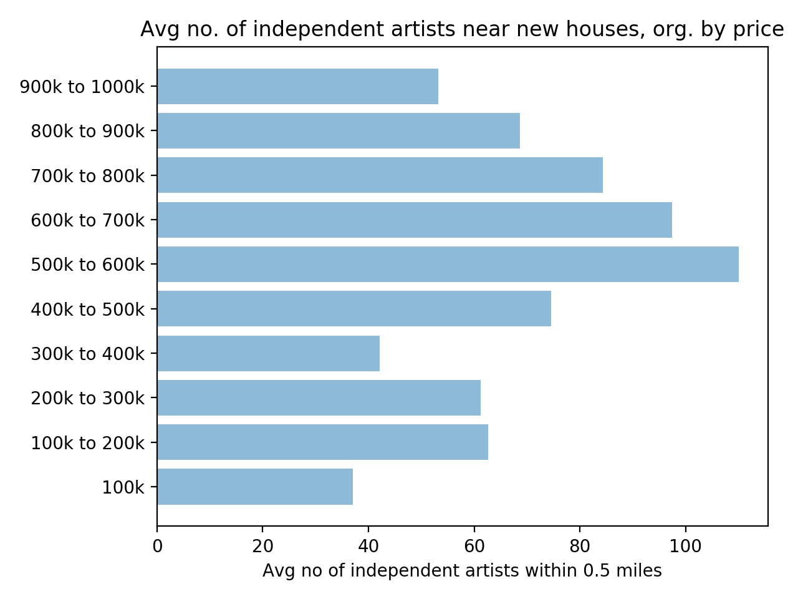
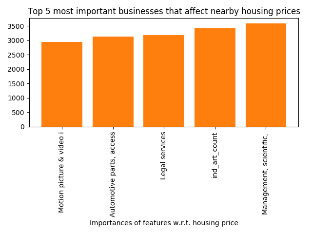
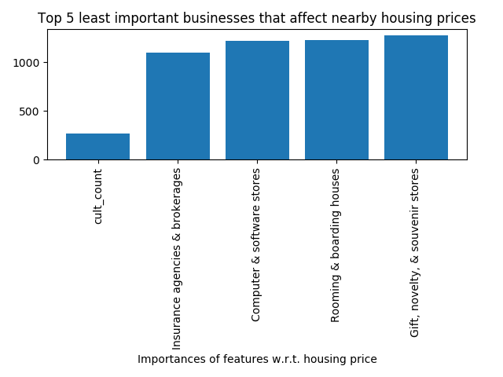

# How Business Types in a Neighborhood Predict Housing Prices

How much does the proximity of a location to certain types of businesses influence housing prices at that location? This has been a hot topic in the LA area recently, as anti-gentrification protestors have successfully shut down art galleries which they took as signs/symptoms of gentrification. I look at public datasets available from the city and county of Los Angeles to determine how the presence of different types of businesses near a housing site affects the valuation of the site. One of the surprising results from this predictive analysis is that proximity to certain types of businesses seems to matter a lot more than zip code, for example. This is somewhat surprising since it suggests that the specific neighborhood (using zip code as a proxy) might affect housing prices less than whether the specific site is close to certain types of businesses. Floor area remains the most important variable in the data I used, but even when you remove floor area and zip code, the algorithm has more than twice the accuracy you'd expect from a random guess.

This is very much a work in progress and I what I have now presents only a preliminary analysis.

## Data Sources

The two most important data sets are ["Listing of Active Businesses"](https://data.lacity.org/A-Prosperous-City/Listing-of-Active-Businesses/6rrh-rzua/data), on the city's portal, and ["Building and Safety Permit Information"](https://data.lacity.org/A-Prosperous-City/Building-and-Safety-Permit-Information/yv23-pmwf), on the city's portal. The data I used from the county's portal was ["Historical and Cultural Resources"](https://data.lacounty.gov/Arts-and-Culture/Historic-Cultural-Resources-2015/e7q7-tit4), which contains data on the locations of historically and culturally important institutions or artifacts in the county. As it turned out, proximity to these institutions had, in my analysis, little to do with housing prices, but I include the source for other users to check for themselves---or there might be some way to filter that dataset for the important types of historical and cultural resources.

"Building and Safety Permit Information" is where I obtained the information on the prices and locations of new housing. The data set starts from 2013 and continues to 2017. I limited my analysis to single- or two-family housing, since I feared that apartment housing would vary more drastically in size and make the data too noisy.

These are all .csv files and therefore easily imported as dataframes into Pandas.

### Prerequisites

I processed the data using a Python script. To run the code, you need the Python packages scikit-learn, Pandas, xgboost, matplotlib, and Geopy. Instructions for installing each of these are easily found online.

### Scripts

I have divided the code into four parts.

new_hous.py processes the housing data file to extract latitude and longitude as a tuple from either the latitude/longtiude strings in the data file (if available) or the street address (if the former is not available). I then save the dataframe with the latitude/longitude tuples in a .csv file for future manipulation.

active_bus.py processes both the housing and businesses data files. It goes through the files containing business locations and counts how many of certain types of businesses are close to the locations of new housing contained in the "Building Permits" data set. The counts are saved in a new column in the dataframe, which is again saved to a new file for future manipulation.

plot.py does some exploratory analysis of correlations between proximity to certain business types and housing prices, which was done to convince myself that the trends were non-trivial and interesting. It plots graphs of housing prices (binned into 100k windows), against the average frequency of certain businesses within X miles of the housing location. One interesting trend is that both proximity to grocery stores and proximity to independent artists had a non-monotonic relationship, in which houses in the middle of the  price range I consider are most likely to be close to the relevant institutions. Below I include the plot for independent artists.

xgboost_cv.py is where I train an xgboost algorithm and cross-validate it. Using the numbers of various kinds of businesses within X miles of the housing location as numerical variables, I try to predict housing prices at said location. There are ten categories in all, and each covers a range of $100k between $0 and $1 million. The building permits dataset is automatically split by Python into training and test sets so that I can evaluate the accuracy of the algorithm. The cross-validation parts can be commented out for the purposes of getting a final prediction and calculating a final log loss.

## Results

I ran the analysis with and without including the variables of floor area and zip code. When I include those, the log loss is ~1.00 (which means it performs ~3.6 times better than chance) and the most important factor by far is floor area, which is surprising. In contrast, zip code surprisingly matters a lot less than proximity to certain types of businesses. Other surprises include the fact that proximity to historical and cultural resources is one of the least important factors. I've extracted the importance results, showing only the most and least important features.

Even when I exclude floor area and zip code, the log loss is ~1.45 (~2.3 times better than chance). This suggests that the types of nearby institutions are pretty influential on housing prices.

